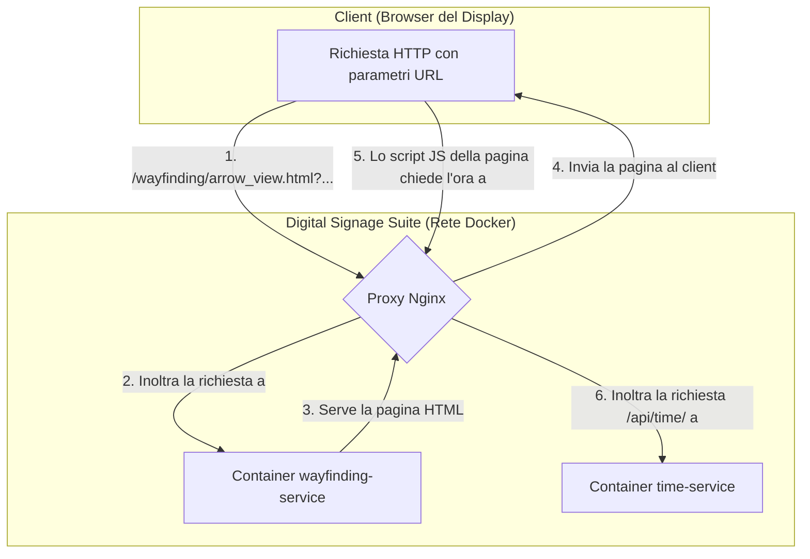

# Wayfinding Service (Servizio di Indicazioni)

[](https://shields.io/)
[](https://www.python.org/)
[](https://flask.palletsprojects.com/)
[](https://opensource.org/licenses/MIT)

Un microservizio visuale per mostrare indicazioni direzionali (frecce) e informazioni sui piani (ascensore), configurabile interamente tramite parametri URL.


---

## Indice

- [Panoramica del Progetto](#panoramica-del-progetto)
- [Diagramma dell'Architettura](#diagramma-dellarchitettura)
- [Caratteristiche Principali](#caratteristiche-principali)
- [Tecnologie Utilizzate](#tecnologie-utilizzate)
- [Struttura della Directory](#struttura-della-directory)
- [Prerequisiti](#prerequisiti)
- [Guida all'Installazione](#guida-allinstallazione)
- [Utilizzo e Parametri URL](#utilizzo-e-parametri-url)
- [Esecuzione dei Test](#esecuzione-dei-test)
- [Come Contribuire](#come-contribuire)
- [Licenza](#licenza)

---

## Panoramica del Progetto

Il `wayfinding-service` è un componente essenziale della Digital Signage Suite per l'orientamento all'interno degli edifici. Fornisce due tipi di visualizzazioni statiche ma altamente configurabili:
1.  **`arrow_view.html`**: Mostra fino a tre frecce direzionali animate, ognuna con una propria etichetta e orientamento.
2.  **`elevator_view.html`**: Mostra una lista di uffici, aule o dipartimenti presenti a un determinato piano.

Il contenuto di ogni display è controllato dinamicamente passando dei parametri nella query string dell'URL.

---

## Diagramma dell'Architettura

Questo servizio è principalmente un server di file statici intelligente, che si appoggia al `time-service` per sincronizzare gli orologi.



---

## Caratteristiche Principali

- ✅ **Due Viste Distinte**: Fornisce layout ottimizzati per indicazioni con frecce e per informazioni da ascensore.
- ⚙️ **Altamente Configurabile**: Il testo, la direzione delle frecce e il contenuto delle liste sono interamente controllati tramite parametri URL.
- 🌐 **Multilingua**: Supporta il cambio dinamico tra Italiano e Inglese per le etichette predefinite.
- 🕒 **Ora Sincronizzata**: L'orologio visualizzato è sincronizzato con il `time-service` centrale per garantire coerenza su tutti i display.
- 🛡️ **Sicurezza**: Include `Talisman` con una Content Security Policy (CSP) per proteggere da attacchi XSS.
- 🐳 **Containerizzato**: Completamente gestito tramite Docker e Docker Compose.
- 🧪 **Testato**: Include una suite di test `pytest` per verificare il corretto funzionamento delle rotte.

---

## Tecnologie Utilizzate

- **Backend**: Python 3.11, Flask, Gunicorn
- **Frontend**: HTML5, CSS3, JavaScript (con animazioni Lottie)
- **Containerizzazione**: Docker, Docker Compose
- **Sicurezza**: Flask-Talisman, Flask-Cors
- **Testing**: Pytest

---

## Struttura della Directory
```
wayfinding-service/
├── app/
│   ├── __init__.py       # Application factory
│   ├── config.py         # Caricamento configurazione (attualmente vuoto)
│   └── routes.py         # Definizione delle rotte per servire le pagine e l'health check
│
├── tests/
│   ├── __init__.py
│   └── test_wayfinding_api.py # Test per le rotte
│
├── ui/
│   ├── assets/           # Animazione Lottie (arrow.json), icone e immagini
│   ├── static/
│   │   ├── css/          # Fogli di stile per le viste
│   │   └── js/           # Script per la logica del frontend
│   ├── arrow_view.html
│   └── elevator_view.html
│
├── .env.example
├── Dockerfile
├── requirements.txt
└── run.py
```

---

## Prerequisiti

- [Docker Engine](https://docs.docker.com/engine/install/)
- [Docker Compose V2](https://docs.docker.com/compose/install/)

---

## Guida all'Installazione

1.  **Clona il Repository**.
2.  **Avvia lo Stack Docker**: Dalla cartella principale `DigitalSignageSuite`, esegui:
    ```bash
    docker compose up --build -d
    ```
    *(Questo servizio non richiede un file .env per funzionare nella sua versione statica).*

---

## Utilizzo e Parametri URL

L'aspetto di ogni display è controllato dai parametri aggiunti all'URL.

### Vista Frecce (`arrow_view.html`)

- **URL Base:** `http://<IP_SERVER>/wayfinding/arrow_view.html`
- **Parametri:**
    - `left`, `center`, `right`: Testo da visualizzare per ciascuna freccia (es. `AULE_A-1`). L'underscore `_` viene convertito in spazio.
    - `leftDirection`, `centerDirection`, `rightDirection`: Direzione della freccia. Valori possibili: `up`, `down`, `left`, `right`, `up-left`, `up-right`, `down-left`, `down-right`. (Default: `down`).
    - `location`: Testo da mostrare in basso a destra (es. `Blocco_A`).

- **Esempio:**
  ```
  http://localhost/wayfinding/arrow_view.html?left=AULE_A-1&leftDirection=left&center=USCITA&centerDirection=up&location=Blocco_A
  ```

### Vista Ascensore (`elevator_view.html`)

- **URL Base:** `http://<IP_SERVER>/wayfinding/elevator_view.html`
- **Parametri:**
    - `floor`: Titolo e numero del piano (es. `1_PRIMO_PIANO`).
    - `content`: Lista di elementi da visualizzare, separati da virgola (es. `AULE,STUDI_DOCENTI,SEGRETERIA`).
    - `location`: Testo da mostrare in basso a destra.

- **Esempio:**
  ```
  http://localhost/wayfinding/elevator_view.html?floor=1_PRIMO_PIANO&content=SEGRETERIA_STUDENTI,AULE_A-1-1_A-1-8,STUDI_DOCENTI&location=Edificio_A
  ```

---

## Esecuzione dei Test
Assicurati che lo stack Docker sia in esecuzione. Poi, esegui:
```bash
cd wayfinding-service
pytest
```

---

## Come Contribuire

I contributi sono sempre i benvenuti! Per contribuire:
1.  Fai un fork del repository.
2.  Crea un nuovo branch (`git checkout -b feature/nome-feature`).
3.  Fai le tue modifiche e assicurati che i test passino (`pytest`).
4.  Fai il commit delle tue modifiche (`git commit -am 'Aggiungi nuova feature'`).
5.  Fai il push sul tuo branch (`git push origin feature/nome-feature`).
6.  Apri una Pull Request.

---

## Licenza
Questo progetto è rilasciato sotto la Licenza MIT.